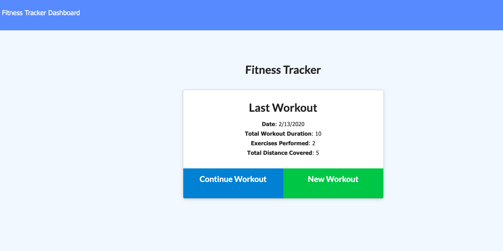
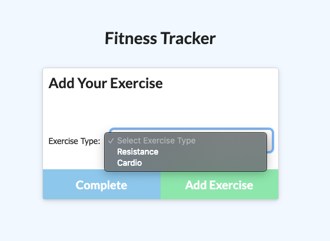
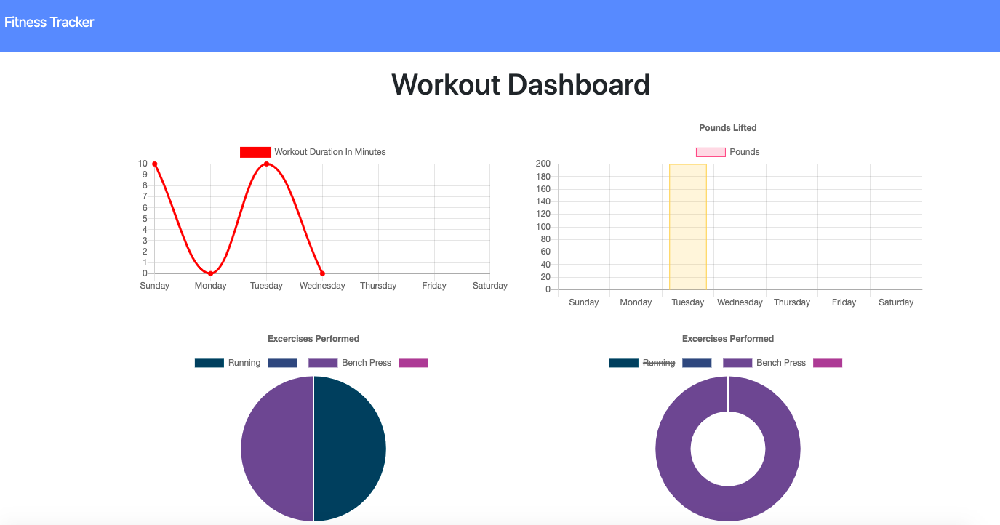

## Fitness-Tracker

### User Story
As A user, I WANT TO be able to view create and track daily workouts. I WANT TO be able to log multiple exercises in a workout on a given day. I should also be able to track the name, type, weight, sets, reps, and duration of exercise. If the exercise is a cardio exercise, I should be able to track my distance traveled.

### Business Context
A consumer will reach their fitness goals quicker when they track their workout progress.

### How It Works
From the homepage, the user is able to add and modify workouts. 

The workouts are broken into two categories: cardio and resistance training.

Once the workouts have been entered, the user can click the Dashboard button in the navbar to view a dynamic graph of their workout stats for the week.

[Here is a link to the project's github repo!](https://github.com/hthomas93/fitness-tracker)

